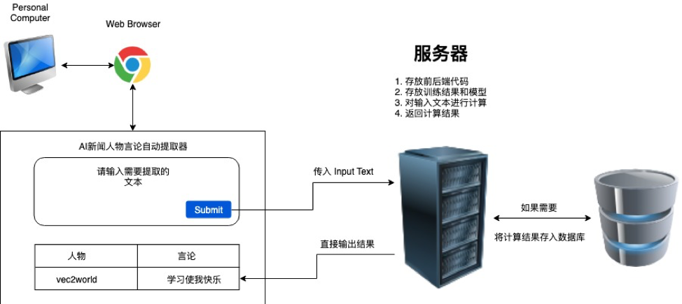

# team_vec2world

## Workflow

### Step 1 - building a dictionary of `{person/organization: quotes}`
1. news corpus ---> word2vec ---> word vectors;
2. word vectors ---> find the top 200 similar words to "说" ---> filter out non-verbs using stanford-corenlp `pos` tags;
3. news corpus ---> stanford-corenlp `ner` ---> list of persons & organizations;
4. news corpus ---> stanford-corenlp `quotes` ---> extract direct quotes (e.g., 美财政部长姆努钦对媒体回应说：“目前还没有这方面的安排。”)
5. news corpus ---> stanford-corenlp `tokensregex` ---> extract indirect quotes using the list of similar words to "说" (e.g., 此后特朗普发推特呼吁中国现在就采取行动。)

### Step 2 - building a user-interface
